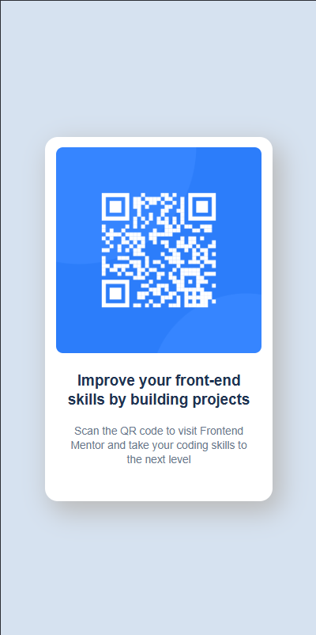
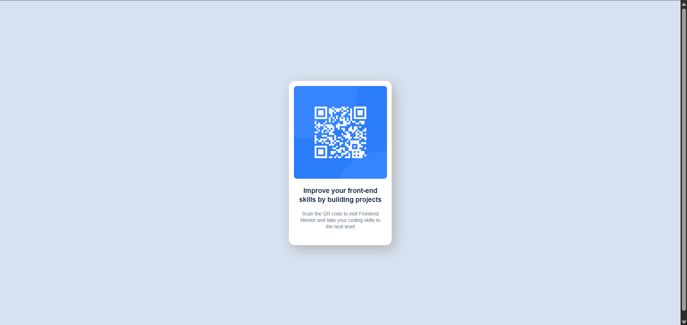

# Frontend Mentor - QR code component solution

This is a solution to the [QR code component challenge on Frontend Mentor](https://www.frontendmentor.io/challenges/qr-code-component-iux_sIO_H). Frontend Mentor challenges help you improve your coding skills by building realistic projects. 

## Table of contents

- [Overview](#overview)
  - [Screenshots](#screenshots)
  - [Links](#links)
- [My process](#my-process)
  - [Built with](#built-with)
  - [What I learned](#what-i-learned)
  - [Useful resources](#useful-resources)
  - [Continued development](#continued-development)
- [Author](#author)
- [Acknowledgments](#acknowledgments)

## Overview

### The challenge

Users should be able to:
- View the optimal layout for the component depending on their device's screen size.

### Screenshots




### Links

- ✅ Solution URL: [FrontendMentor solution](https://www.frontendmentor.io/solutions/qr-code-component-layout-using-html-and-css-yZrwvr_Fs5)
- 🌐 Live Site URL: [View Website](https://swaandafj.github.io/qr-code-frontendMentor/)

## My process

### Built with

- Semantic HTML5 markup
- CSS custom properties
- Flexbox
- Mobile-first workflow

### What I learned

This project was a great way to practice layout fundamentals. I gained a better grasp of the `box-shadow` property to add depth to the UI and give a professional feel. I learned how to manipulate offsets and blur radii to create a soft, modern elevation effect.

```css
.card {
  /* I learned that the values represent: x-offset, y-offset, blur, spread, and color */
  box-shadow: 7px 9px 25px 2px #bbb;
}
```

### Useful resources

[Google Fonts](https://fonts.google.com/) - Used to import the "Outfit" font required for the design.

### Continued development

In future projects, I want to explore:
- **CSS Grid:** To see how it compares to Flexbox for simple card layouts.
- **Advanced Typography:** Better handling of responsive font sizes and line heights.
- **Creative evolution:** Improving my creative approach to UI development by moving beyond standard templates to solve layout challenges through expressive CSS techniques.

## Author

- 🌐 [View Website](https://swaandafj.github.io/qr-code-frontendMentor/)
- Frontend Mentor - [@swaandaFJ](https://www.frontendmentor.io/profile/swaandaFJ)
- Twitter - [@swaan_dagwi](https://www.twitter.com/swaan_dagwi)
- Instagram - [@swaandagwi](https://www.instagram.com/swaandagwi)

---
*[Swaandagwi Feng Jah]*